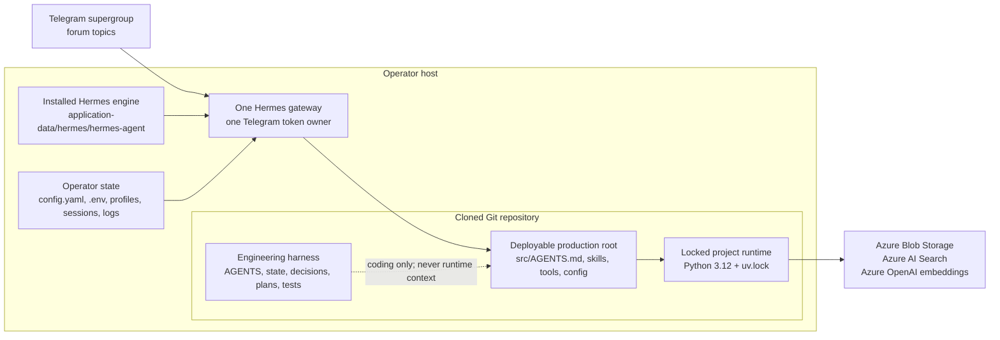
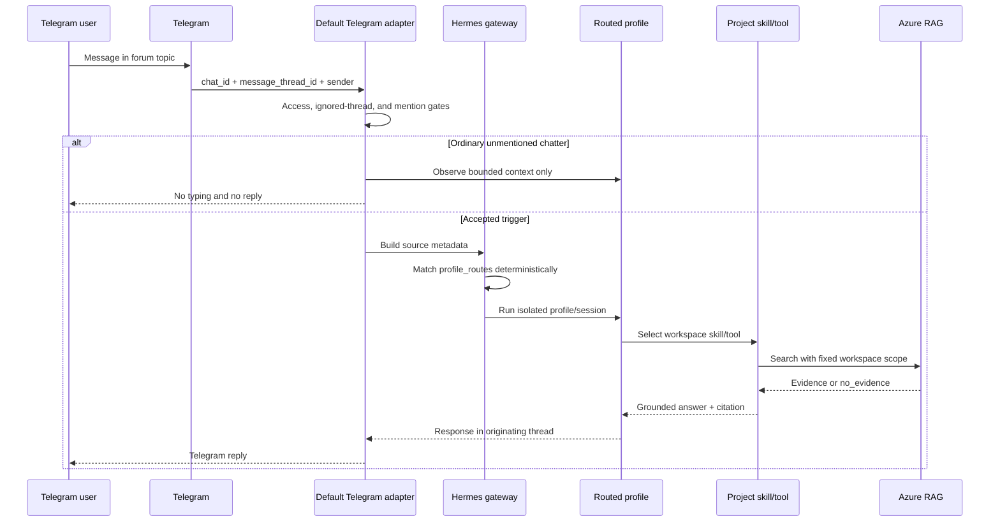
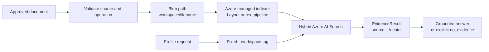

# Hermes Business Agent Architecture

## Purpose

This document explains how installed Hermes Agent, operator-owned local state,
and this Git repository work together. It describes current Protein Bar pilot,
not an imaginary future deployment.

## System Boundaries



Three roots have different owners:

| Root | Owner | Purpose | Git-tracked |
|---|---|---|---|
| Hermes installation | Hermes distribution | Agent engine, gateway, adapters, CLI | No |
| Hermes application data | Operator | Secrets, config, profiles, sessions, logs | No |
| Repository root | Engineering | Harness, plans, verification, deployable `src` | Yes |
| Repository `src/` | Production project | Runtime policy, skills, tools, locked dependencies | Yes |

Paths are deployment-specific. On Windows, Hermes normally stores installation
and operator state below `%LOCALAPPDATA%\hermes`. Other hosts use their own Hermes
home. Runtime config must point to absolute deployed `src` path; it must not
point to repository root.

## Runtime Context Boundary

Root files such as `AGENTS.md`, `DECISIONS.md`, `PROGRESS.md`, and `docs/` guide
coding agents. They are not Hermes production context.

Hermes starts in deployed `src/` and reads [`src/AGENTS.md`](src/AGENTS.md).
Project capabilities live in [`src/skills`](src/skills), deterministic tools live
in [`src/tools`](src/tools), and runtime policy lives in [`src/config`](src/config).
This prevents planning notes and machine-local handoffs from leaking into the
business assistant prompt.

## Telegram Request Flow



Current pilot mapping:

| Telegram source | Action |
|---|---|
| Supergroup `-1003835812097`, thread `11` | Route to `protein-bar` |
| Thread `5` (TITAN AI) | Ignore; no real profile onboarded |
| Thread `1` (General) | Ignore during pilot |
| Unmatched source | Hermes can fall back to default; access/ignore gates must prevent accidental business access |

Workspace selection uses source metadata, never natural-language intent. Intent
classification can occur only after profile selection.

## Shared Telegram Credential Ownership

One bot token is polled by one adapter: default gateway adapter. Routed secondary
profiles must not repeat that Telegram credential. Hermes rejects two profiles
using the same polling credential with `duplicate_credential`.

`gateway.profile_routes` selects profile runtime after default adapter receives a
message. It does not require a second Telegram adapter.

Required trigger shape:

```yaml
telegram:
  require_mention: true
  exclusive_bot_mentions: true
  mention_patterns: []
  observe_unmentioned_group_messages: true

gateway:
  multiplex_profiles: true
  profile_routes:
    - name: telegram-protein-bar
      platform: telegram
      chat_id: "-1003835812097"
      thread_id: "11"
      profile: protein-bar
```

Direct replies to bot messages, explicit mentions, addressed slash commands, and
configured mention patterns are official triggers. Privacy Mode controls what
Telegram delivers; `require_mention` controls what Hermes executes.

## Profile Isolation

Each routed profile owns persona and policy, session namespace and memory,
profile configuration and non-shared secrets, fixed business workspace identity,
and tool execution context.

Protein Bar sessions use an `agent:protein-bar:...` namespace. Current Telegram
route was verified as `agent:protein-bar:telegram:group:-1003835812097:11`.

## Project Tool Runtime

Hermes and project tools use separate Python environments:

```text
Hermes CLI/gateway
  -> Hermes-managed Python environment

src skills
  -> uv run --frozen
  -> src/.python-version (Python 3.12)
  -> src/pyproject.toml + src/uv.lock
  -> Azure/Crawl4AI project tools
```

This split prevents project packages from mutating Hermes installation. Operators
bootstrap project dependencies once with `src/setup.cmd` or `src/setup.sh`.
Chat-driven agents use `uv run --frozen`; they do not install packages or change
the lockfile.

## Azure Knowledge Flow



Isolation is defense-in-depth:

1. Telegram source selects profile.
2. Profile policy fixes workspace identity.
3. Blob paths carry workspace prefix/metadata.
4. Search adds workspace filter.
5. Answer policy requires valid evidence and truthful citation.

A cross-workspace Protein Bar query scoped to `titan-ai` has been verified to
return `no_evidence`.

## State and Secret Ownership

| State | Location | Rule |
|---|---|---|
| Bot/API credentials | Hermes operator `.env` or approved secret store | Never commit |
| Gateway/profile config | Hermes operator home | Back up before edits; never commit |
| Sessions/logs | Hermes operator home | Runtime-owned; not deployment source |
| Azure credentials | `src/.env` on deployed host | Derived from `.env.example`; never commit |
| Runtime policy/code | `src/` | Git source of truth |
| Feature state/handoff | Repository root | Coding source of truth; not runtime context |
| Generated crawl/runtime data | `src/.runtime/` | Local, ignored, reproducible where applicable |

## Gateway Lifecycle

Use Hermes CLI for normal lifecycle:

```powershell
hermes gateway restart
hermes gateway status
```

On current Windows development host, coding-tool child processes were reclaimed
after direct spawn. Agent-operated recovery used clean stop followed by installed
`Hermes_Gateway` Scheduled Task. This is host-specific operational evidence, not
a requirement for every customer host.

Always verify gateway process exists, Telegram adapter is `connected`, served
profiles are expected, no `duplicate_credential` error exists, and a post-restart
topic request resolves to expected profile.

## Trust and Failure Boundaries

- Missing route can fall back to default: gate unknown topics/chats explicitly.
- Duplicate polling token: Hermes refuses secondary adapter startup.
- Privacy Mode enabled: Telegram may not deliver ordinary group context.
- `require_mention` under wrong YAML branch: adapter uses open-group default.
- Azure has no valid evidence: report insufficiency; do not browse silently.
- Image enrichment quota exhausted: text retrieval remains available when image indexer is disabled.
- WhatsApp failure is independent from connected Telegram adapter.

## Current and Deferred Scope

Current verified pilot:

```text
Telegram Protein Bar topic
  -> protein-bar profile
  -> project Azure RAG skill
  -> workspace=protein-bar
  -> cited Telegram answer
```

Deferred until separate approved features: Client Projects and TITAN AI profile
onboarding, HQ cross-workspace orchestration, automatic profile migration, and
legal/permission-driven separate bots or gateways.

## Decision and Source References

- [`DECISIONS.md`](DECISIONS.md): D007, D013, D019, D020.
- [`docs/plan/multi_workspace/multi_workspace_telegram_execution.md`](docs/plan/multi_workspace/multi_workspace_telegram_execution.md).
- Installed Hermes official docs: `website/docs/user-guide/multi-profile-gateways.md` and `website/docs/user-guide/messaging/telegram.md` under installed Hermes source.
- Installed routing source: `gateway/profile_routing.py`, `gateway/run.py`, and Telegram `adapter.py`.
