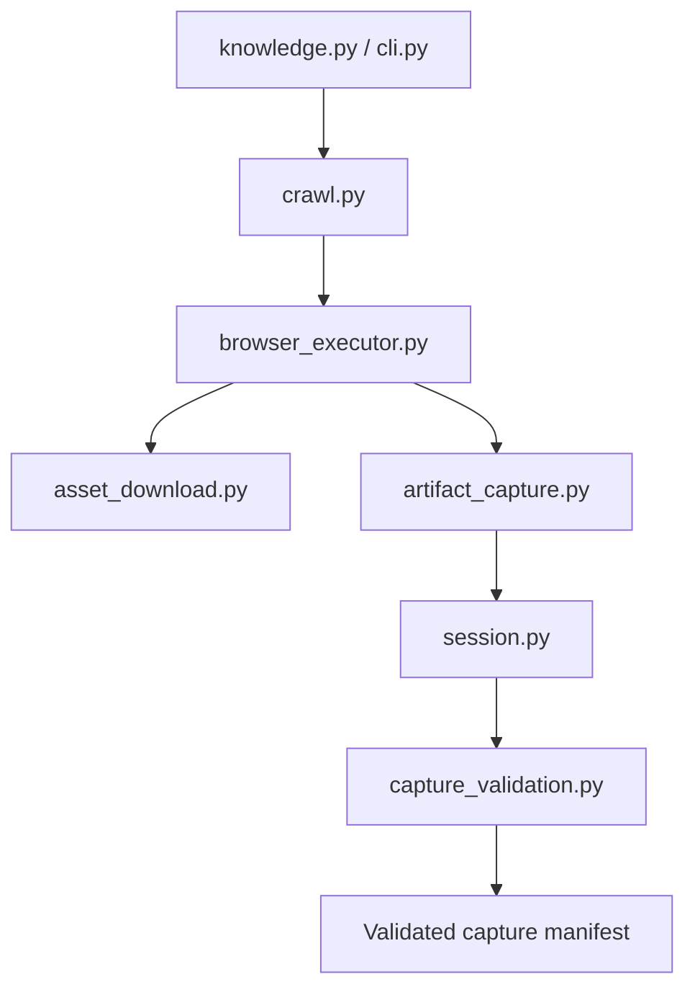
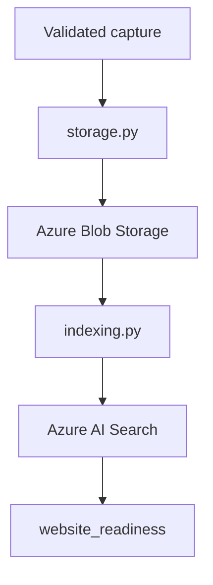
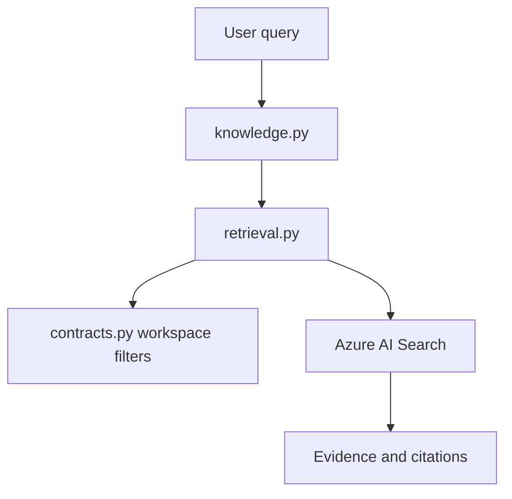

# Knowledge Tool Module Map

Developer guide for `src/tools/knowledge`. This document lives outside `src/` and is not production Hermes context.

System architecture remains owned by `ARCHITECTURE.md`. This file explains how to navigate and maintain the Knowledge Tool implementation.

## Scope

The Knowledge Tool:

- uploads local sources to Azure Blob Storage;
- crawls public websites with Crawl4AI;
- validates crawl evidence and downloaded assets;
- triggers Azure Search indexers;
- verifies indexed evidence;
- retrieves workspace-scoped evidence and citations.

Production working directory is deployed `src/`. Modules currently use script-style imports. Do not move files into subpackages without a separate package-import migration.

## Recommended Reading Order

Do not read files alphabetically. Follow the flow being changed.

### CLI and command execution

1. `knowledge.py` — entrypoint and command workflow dispatch.
2. `cli.py` — arguments, flags, and subcommands.
3. `clients.py` — Azure client/config construction.

### Website crawl

1. `crawl.py` — trusted crawl orchestration and frontier handling.
2. `browser_executor.py` — Crawl4AI browser lifecycle and page capture.
3. `asset_download.py` — image candidate selection and bounded download.
4. `artifact_capture.py` — CrawlResult to artifact/event/page mapping.

### Trust boundary

1. `url_validation.py` — URL normalization and public DNS/IP checks.
2. `policy.py` — website crawl policy and budgets.
3. `session.py` — session state and accepted observation invariants.
4. `capture_validation.py` — page/asset binding, path, MIME, and digest checks.

### Azure ingestion and retrieval

1. `storage.py` — Blob upload and deletion.
2. `indexing.py` — indexer execution, waits, readiness, and absence checks.
3. `retrieval.py` — search filters, multi-query merge, and evidence mapping.
4. `provision.py` — Azure Search resource provisioning.
5. `contracts.py` — workspace/source path and evidence contracts.

## Module Ownership

| Module | Owns | Does not own |
|---|---|---|
| `knowledge.py` | command workflows and JSON output | argument definitions, crawl internals |
| `cli.py` | CLI parser and flags | command behavior |
| `clients.py` | config and Azure client construction | Azure operations |
| `contracts.py` | evidence/workspace/path contracts | storage or search calls |
| `policy.py` | crawl policy schema and loading | live crawl state |
| `url_validation.py` | URL normalization and SSRF/public-host validation | browser navigation |
| `session.py` | crawl session lifecycle and observation invariants | browser execution |
| `crawl.py` | crawl frontier and completion orchestration | browser implementation |
| `browser_executor.py` | Crawl4AI setup, capture, disclosure hook | artifact schema validation |
| `asset_download.py` | relevant image filtering and safe download | Azure image indexing |
| `artifact_capture.py` | persisted artifacts, event/page mapping | session acceptance |
| `capture_validation.py` | finalized capture trust validation | uploading captures |
| `storage.py` | Blob source/page/asset upload and deletion | Search readiness |
| `indexing.py` | indexer status/waits and evidence readiness | evidence ranking |
| `retrieval.py` | scoped search and evidence mapping | indexer lifecycle |
| `provision.py` | Azure resource definitions/provisioning | runtime search |
| `web.py` | backward-compatible public exports | new implementation logic |
| `command_guard.py` | operator command safety rules | command execution |

## Runtime Flows

### Website capture



### Website ingestion



### Evidence retrieval



## Dependency Direction

Preferred direction:

```text
CLI / orchestration
    -> domain validation and contracts
    -> Crawl4AI or Azure adapters
    -> external services
```

Rules:

- validation modules must not import CLI orchestration;
- storage and retrieval must not import browser code;
- browser code may call URL validation but must not weaken it;
- `web.py` is a compatibility facade, not a place for new behavior;
- operator/runtime paths must remain under deployed `src/`.

## Where to Change a Feature

| Change | Start here | Also inspect |
|---|---|---|
| Add or change CLI flag | `cli.py` | `knowledge.py`, Layer 1 verifier |
| Change command JSON output | `knowledge.py` | callers and Layer 2 verifier |
| Change URL acceptance/security | `url_validation.py` | `session.py`, `artifact_capture.py`, `asset_download.py` |
| Change crawl budgets | `policy.py` | `session.py`, policy JSON |
| Change frontier behavior | `crawl.py` | session completion tests |
| Change browser settings | `browser_executor.py` | installed Crawl4AI API |
| Change FAQ/disclosure interaction | `browser_executor.py` | artifact disclosure tests |
| Change image relevance heuristic | `asset_download.py` | Crawl4AI media and asset tests |
| Change artifact/event schema | `artifact_capture.py` | `session.py`, capture tests |
| Change page/asset trust checks | `capture_validation.py` | storage metadata requirements |
| Change Blob metadata/upload | `storage.py` | Azure index definitions |
| Change indexer wait/readiness | `indexing.py` | Azure SDK behavior tests |
| Change search scope/filter | `retrieval.py` | `contracts.py`, workspace tests |
| Change Azure resources | `provision.py` | resource definition JSON files |

## Security and Evidence Invariants

Do not remove these as “defensive complexity”:

- only public HTTP(S) targets;
- DNS results must not include private, loopback, link-local, or reserved IPs;
- redirects and canonical URLs remain within the approved origin;
- downloaded assets obey MIME allowlist and byte budget;
- asset paths remain under runtime storage;
- asset and artifact digests bind persisted bytes;
- crawl events bind to trusted Crawl4AI artifacts;
- website and generation IDs isolate indexed evidence;
- workspace/access-group filters apply to retrieval;
- destructive website deletion requires exact confirmation.

Crawl4AI and Azure SDK provide transport and extraction APIs. They do not own these Hermes trust boundaries.

## Compatibility Surfaces

Existing code and verifiers may import these symbols through facade modules.

### `web.py`

- `normalize_public_url`
- `validate_public_target`
- `start_session`
- `accept_observation`
- `finalize_session`
- `validate_capture`
- `capture_diff`
- `load_manifest`

### `browser_executor.py`

- `BrowserArtifact`
- `map_crawl_result`
- `select_relevant_images`
- `download_asset`
- `Crawl4AISession`

Keep these exports until a separate package-import migration updates every caller.

## Verification

Run gates in order.

### Layer 1 — repository root

```powershell
python tests\verify_knowledge.py --layer 1
```

### Layer 2 — from `src`

```powershell
C:\Users\ADMIN\.local\bin\uv.exe run --frozen python ..\tests\verify_knowledge.py --layer 2
```

### Static checks — repository root

```powershell
python -m compileall -q src\tools tests
conda run -n base flake8 src\tools\knowledge --select="F401,F811,F821,F841,E302,E303,E304,E305,E306,C901" --max-complexity=10
git diff --check
```

Known Azure SDK warning:

```text
NativeBlobSoftDeleteDeletionDetectionPolicy has no mapping
```

This warning is not a current verification failure.

## Why the Folder Remains Flat

Splitting now would change script-style imports, dynamic verifier loading, entrypoints, and production launch assumptions at once.

Create subfolders only after a dedicated package-import migration provides:

1. `__init__.py` package boundaries;
2. package-relative imports;
3. module entrypoints such as `python -m tools.knowledge.knowledge`;
4. verifier support for package loading;
5. Layer 1/2 evidence after each migrated boundary.

Candidate future groups:

```text
knowledge/
  crawl/
  azure/
  validation/
  cli/
```

Do not combine package migration with behavior refactoring.
